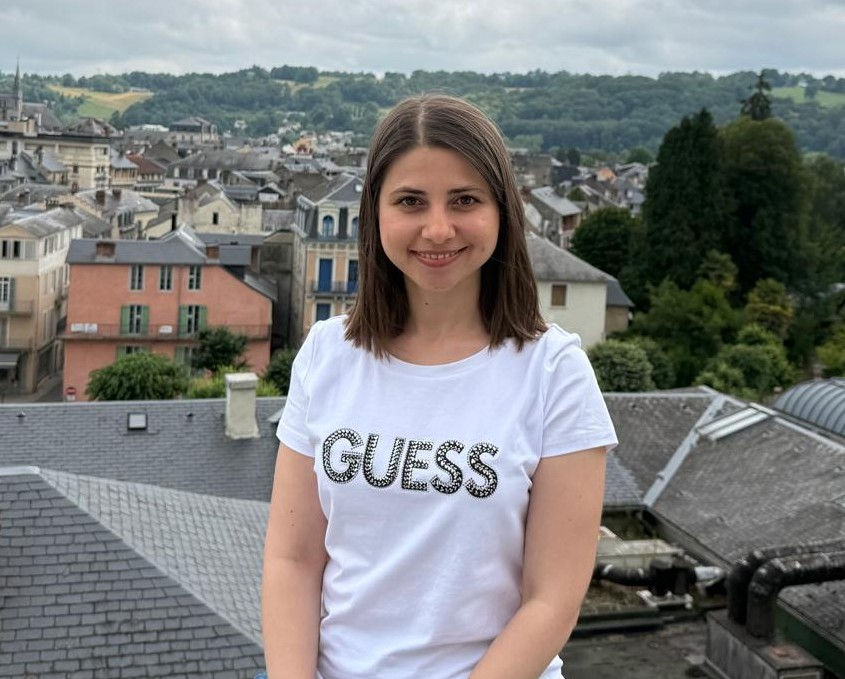

**Zeina Bourhane, PhD**

**Postdoctoral Research Fellow**

[Institute of Analytical Sciences and Physico-Chemistry for the Environment and Materials (IPREM)](https://iprem.univ-pau.fr/fr/index.html)

[Université de Pau et des Pays de l'Adour](https://www.univ-pau.fr/fr/index.html), France

Microbial ecology  | Metagenomics | Metabolomics | Ecotoxicology | Bioinformatics | Data Scientist 

📍 Pau, France  

📧 **[Email](zeina.bourhane@hotmail.com)**

**[Google Scholar](https://scholar.google.es/citations?user=NH2VWoIAAAAJ&hl=en&oi=ao)** | **[LinkedIn](https://www.linkedin.com/in/zeina-bourhane-772373144)** | **[HAL](https://hal.science/984215)** | **[ORCID](https://orcid.org/0000-0002-9663-2584)** | **[ResearchGate](https://www.researchgate.net/profile/Zeina-Bourhane)** | **[Loop](https://loop.frontiersin.org/people/1666424/overview)** | **[ScholarNet](https://www.scholarnet.net/?author=A5076378298)**

---
## About Me

Scientist in microbial ecology, with expertise in metagenomics, metabolomics and microbial network analysis applied to the valorization of extreme ecosystems.

My research focuses on the microbial ecology of aquatic and terrestrial environments, with a particular emphasis on extreme ecosystems such as thermal waters. I am interested in understanding the dynamics of microbial communities under environmental stress and the factors shaping their structure, function, and adaptation to changing conditions.

Using integrative multi-omics approaches, including metagenomics, metabolomics, and network analyses, I aim to link microbial diversity to functional potential and metabolic activity. My work seeks to identify key microbial taxa, biosynthetic pathways, and bioactive metabolites, as well as potential bioindicators and genetic biomarkers for environmental monitoring.

More broadly, my research contributes to advancing our understanding of microbial ecosystem functioning and to unlocking the biotechnological potential of microbiomes for sustainable applications.

---
## Research Fields

- Valorization of extreme ecosystems
- Secialized thermostable metabolites
- Microbial interaction and functional networks
- Microbial collective biosynthetic potential
  
---
## Education

**Ph.D. in Physiology and Biology of organisms-Populations-Interactions**  
[09/2018 – 12/2021]   [Université de Pau et des Pays de l'Adour](https://www.univ-pau.fr/fr/index.html), France

**Ph.D. European Label** 
[09/2018 – 12/2021]   [Université de Pau et des Pays de l'Adour](https://www.univ-pau.fr/fr/index.html), France

**MSc. in Management and Conservation of Natural Resources**  
[09/2016 – 06/2018]    Lebanese University, Beirut, Lebanon 

**BSc. in Biology**  
[09/2013 – 06/2016]    Lebanese University, Beirut, Lebanon

---
## Core Sills

**Data Analysis and Bioinformatics**

R studio; QIIME2, DADA2; Tax4Fun2, PICRUSt2; CoNet, SparCC, among others.

**Molecular and Microbial Techniques**

eDNA/RNA extraction; DNA QC (NanoDrop/Xpose) & quantification (Qubit); PCR; qPCR-data interpretation

**Computing and Workflow Automation**
Scripted pipelines in R; Linux/Shell batch mode processing; Job submission with Slurm (sbatch) on HPC clusters.

**Teaching and Projects**

Co supervision of MSc students; Participation in multi-institutional projects (AQUASALT, MOBIDIC, CARUSO), contributing to grant writing that secured funding; Stakeholder engagement in French, English & arabic.

----
## CV

👉 [Download my CV](assets/Zeina_CV.pdf)

---

